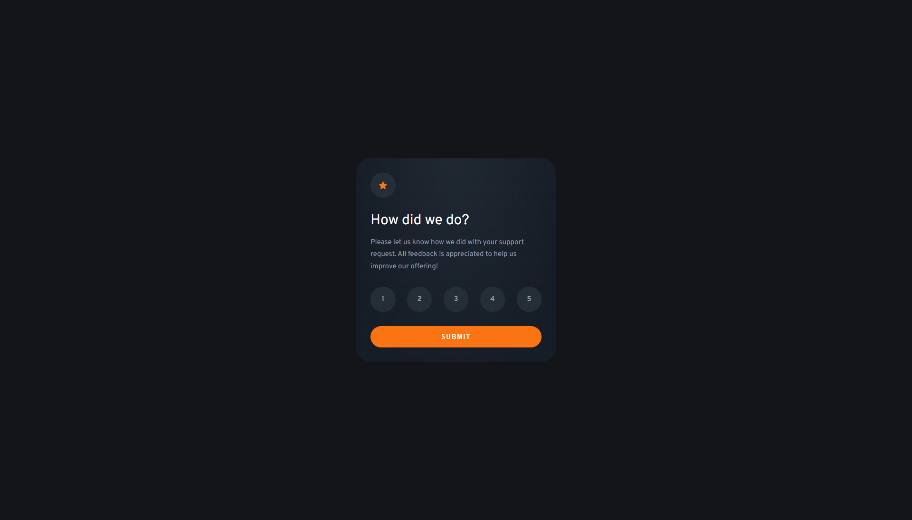
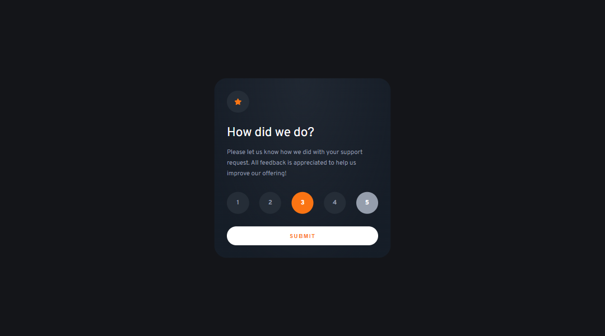
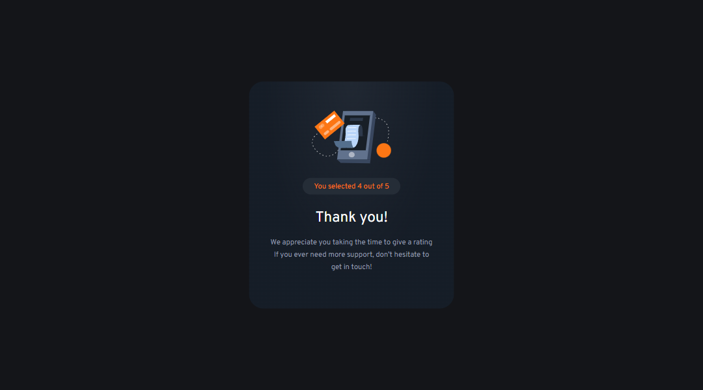
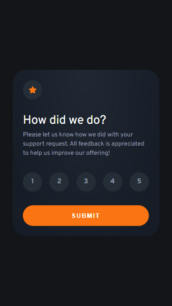
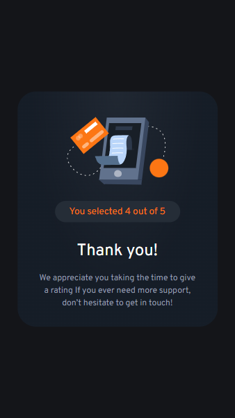

# Frontend Mentor - Results summary component solution

This is a solution to the [Interactive rating component challenge on Frontend Mentor](https://www.frontendmentor.io/challenges/interactive-rating-component-koxpeBUmI). Frontend Mentor challenges help you improve your coding skills by building realistic projects.

## Table of contents

- [Frontend Mentor - Results summary component solution](#frontend-mentor---results-summary-component-solution)
  - [Table of contents](#table-of-contents)
  - [Overview](#overview)
    - [🖼️ Screenshot](#️-screenshot)
    - [🪢 Links](#-links)
  - [My process](#my-process)
    - [Built with](#built-with)
    - [Continued development](#continued-development)
    - [Useful resources](#useful-resources)
  - [Author](#author)

---

 

## Overview

### 🖼️ Screenshot

### 🪢 Links

- Solution URL: [GitHub](https://github.com/maciej-szeremeta/Interactive-rating-component)
- Live Site URL: [GitHub Page](https://maciej-szeremeta.github.io/Interactive-rating-component)

## My process

### Built with

- HTML
- SCSS
- BEM
- Flexbox
- Vanila JS

### Continued development

In the next task I will explore the secrets of the preprocessor.

### Useful resources

- [SCSS](https://sass-lang.com/) - This page helped me understand how SCSS works.

## Author

- Frontend Mentor - [@maciej-szeremeta](https://www.frontendmentor.io/profile/maciej-szeremeta)
